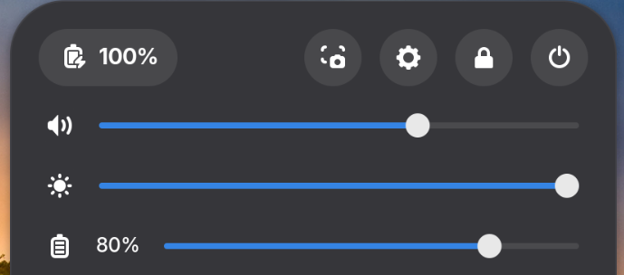
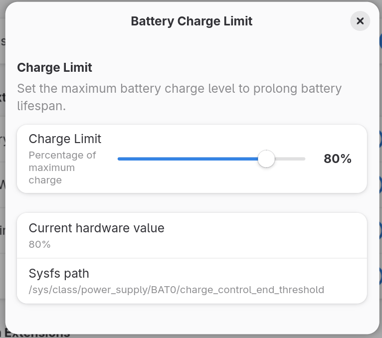

# batlimit

**Battery Charge Limit** — a GNOME Shell 50 extension that adds a charge limit slider to Quick Settings, located right below the brightness slider.

 | 
:---:|:---:
*Slider in Quick Settings* | *Panel indicator*

## Features

- Custom slider in the Quick Settings panel (below brightness)
- Live percentage label between icon and slider bar
- Writes directly to `/sys/class/power_supply/BAT0/charge_control_end_threshold`
- Debounced writes (400ms) — no rapid-fire sudo calls while dragging
- Instant write on slider release (`drag-end` signal)
- Polls hardware every 3s to detect external changes
- Preferences dialog accessible from Extensions app
- Initializes from actual hardware state on load
- Persists limit value in GSettings

## Requirements

- **GNOME Shell 50** (Fedora 44, GNOME 50.x)
- A laptop with `/sys/class/power_supply/BAT0/charge_control_end_threshold` (ASUS ROG, Lenovo, ThinkPad, and most modern laptops)
- `sudo` access (to install the helper script and sudoers rule)

## Installation

### Quick install

```bash
git clone https://github.com/fahrulseptiana/gnome-shell-extensions-batlimit.git batlimit@fahrul.id
cd batlimit@fahrul.id
./install.sh
```

This will:
- Copy the extension into `~/.local/share/gnome-shell/extensions/`
- Compile the GSettings schema
- Install the privileged helper (`/usr/local/bin/batlimit-set`)
- Add a NOPASSWD sudoers entry

Then **log out and back in**, and enable the extension:

```bash
gnome-extensions enable batlimit@fahrul.id
```

### Manual install

```bash
# 1. Symlink the extension
mkdir -p ~/.local/share/gnome-shell/extensions
ln -sfn "$PWD" ~/.local/share/gnome-shell/extensions/batlimit@fahrul.id

# 2. Compile the GSettings schema
glib-compile-schemas ~/.local/share/gnome-shell/extensions/batlimit@fahrul.id/schemas/

# 3. Install the privileged helper
sudo tee /usr/local/bin/batlimit-set > /dev/null <<'HELPER'
#!/bin/bash
set -e
echo "$1" > /sys/class/power_supply/BAT0/charge_control_end_threshold
HELPER
sudo chmod +x /usr/local/bin/batlimit-set

# 4. Add sudoers NOPASSWD rule
echo "$USER ALL=(ALL) NOPASSWD: /usr/local/bin/batlimit-set" | sudo tee /etc/sudoers.d/batlimit > /dev/null
sudo chmod 440 /etc/sudoers.d/batlimit
```

Then **log out and back in**, and enable the extension.

## How it works

```
User drags slider
    │
    ├─→ GSettings charge-limit updated (instant)
    ├─→ Label updates to "80%" (instant)
    ├─→ Debounce timer starts/restarts (400ms)
    │
    ├─→ Timer fires → sudo batlimit-set 80 (debounced)
    └─→ User releases → drag-end → cancel timer → sudo batlimit-set 80 (immediate)
              │
              └─→ /sys/class/power_supply/BAT0/charge_control_end_threshold = 80
```

External writes (e.g. `echo 60 | sudo tee ...`) are detected every 3 seconds and the slider snaps to match.

- Reading hardware does **not** need root (sysfs file is world-readable).
- Writing needs root, so a small helper script (`/usr/local/bin/batlimit-set`) is called via `sudo -n` with a NOPASSWD sudoers entry.

## Project structure

```
batlimit@fahrul.id/
├── extension.js       # Main extension code
├── prefs.js           # Preferences dialog (Extensions app)
├── metadata.json      # Extension metadata (uuid, shell-version)
├── stylesheet.css     # Custom styling for the percentage label
├── install.sh          # One-shot install script
├── uninstall.sh        # Removes all installed components
├── schemas/
│   ├── gschemas.compiled
│   └── org.gnome.shell.extensions.batlimit.gschema.xml
├── LICENSE
├── screenshots/
│   ├── panel.png
│   └── slider.png
└── README.md
```

## Preferences

Open **Extensions** app → find **Battery Charge Limit** → click the gear icon.

- Scale slider to set the charge limit (debounced + writes to hardware)
- Shows current hardware value (updates in real time)
- Polls hardware every 2s to reflect external changes

## Development

Reload the extension without restarting the shell:

```bash
gnome-extensions disable batlimit@fahrul.id && gnome-extensions enable batlimit@fahrul.id
```

Check logs:

```bash
journalctl _UID=$(id -u) --no-pager -n 50 | grep batlimit
```

### Architecture

| Module | Role |
|---|---|
| `BatlimitSlider` | Extends `QuickSlider` — the slider widget with icon + percentage label + slider bar |
| `BatlimitExtension` | Entry point — reads hardware, inserts slider after brightness, polls for external changes |
| `BatlimitPrefs` | Preferences dialog — scale slider with debounce + hardware sync |
| `batlimit-set` | Shell script called via `sudo -n` to write to sysfs |

### Key GNOME Shell APIs used

- `resource:///org/gnome/shell/ui/quickSettings.js` → `QuickSlider`
- `Main.panel.statusArea.quickSettings` → The Quick Settings button and menu
- `QuickSettingsMenu.insertItemBefore()` → Position the slider in the grid
- `Slider` → The actual draggable bar (from `resource:///org/gnome/shell/ui/slider.js`)
- `GLib.spawn_command_line_sync()` → Run sudo helper
- `GLib.timeout_add()` / `GLib.source_remove()` → Debounce + polling

## Troubleshooting

**Slider not appearing?**
```bash
gnome-extensions info batlimit@fahrul.id
```
Enable it with `gnome-extensions enable batlimit@fahrul.id` and relog.

**"Permission denied" in logs?**
Make sure the sudoers file exists and is valid:
```bash
sudo visudo -c -f /etc/sudoers.d/batlimit
```

**Slider appears but doesn't change hardware?**
Check that `/sys/class/power_supply/BAT0/charge_control_end_threshold` exists:
```bash
cat /sys/class/power_supply/BAT0/charge_control_end_threshold
```
If the file doesn't exist, your laptop doesn't support charge limiting via this interface.

## License

MIT — 2026 Fahrul Septiana
